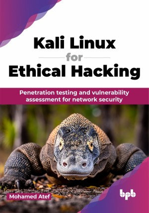

# Kali Linux for Ethical Hacking

Master Kali Linux and become an ethical hacker

This is the repository for [Kali Linux for Ethical Hacking
](https://bpbonline.com/products/kali-linux-for-ethical-hacking),published by BPB Publications.

## About the Book
This book is a comprehensive guide for anyone aspiring to become a penetration tester or ethical hacker using Kali Linux. It starts from scratch, explaining the installation and setup of Kali Linux, and progresses to advanced topics such as network scanning, vulnerability assessment, and exploitation techniques.

Readers will learn information gathering with OSINT and Nmap to map networks. Understand vulnerability assessment using Nessus, OpenVAS, and Metasploit for exploitation and privilege escalation. Learn persistence methods and data exfiltration. Explore wireless network security with Aircrack-ng and best practices for Wi-Fi security. Identify web vulnerabilities using Burp Suite. Automate tasks with Bash scripting, and tackle real-world penetration testing scenarios, including red team vs blue team exercises.

By the end, readers will have a solid understanding of penetration testing methodologies and be prepared to tackle real-world security challenges.

## What You Will Learn
• Install and configure Kali Linux.

• Perform network scanning and enumeration.

• Identify and exploit vulnerabilities.

• Conduct penetration tests using Kali Linux.

• Implement security best practices.

• Understand ethical hacking principles.
